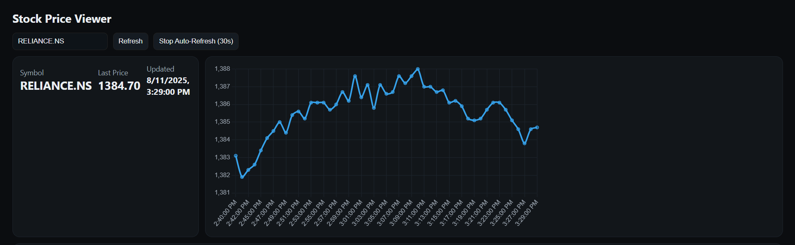

# 📈 Real-time Stock Alert System

A **real-time stock monitoring and alert system** built with **Flask**, **Yahoo Finance API**, **SQLite**, and a **Chart.js UI**.  
This project fetches live stock prices, stores historical data, and alerts users when a stock crosses a set price threshold.

---

## 🚀 Features
- **Live Stock Price Fetching** using `yfinance`
- **Price Threshold Alerts** for chosen stocks
- **Historical Data Storage** in SQLite
- **Interactive Web UI** with Chart.js
- **Auto-Refresh Mode** for live updates
- **Environment Variables** for secure configuration

---

## 🛠️ Tech Stack
- **Backend**: Python, Flask
- **Data**: SQLite, Pandas
- **Frontend**: HTML, CSS, JavaScript, Chart.js
- **API**: Yahoo Finance (`yfinance`)

---

## 📂 Project Structure
```
stock-alert-system/
│── templates/
│   └── index.html       # Frontend UI
│── alerts.py            # Alert handling logic
│── app.py               # Flask server
│── fetch_stock.py       # Fetches live stock prices
│── store_data.py        # Stores stock history in SQLite
│── requirements.txt     # Python dependencies
│── .env.example         # Example environment variables
│── README.md            # Project documentation
│── stocks.db            # SQLite database (auto-generated)
```

---

## ⚙️ Installation & Setup

### 1️⃣ Clone the Repository
```bash
git clone https://github.com/adiprabhu04/stock-alert-system.git
cd stock-alert-system
```

### 2️⃣ Create Virtual Environment & Install Dependencies
```bash
python -m venv venv
source venv/bin/activate  # On Windows: venv\Scripts\activate
pip install -r requirements.txt
```

### 3️⃣ Configure Environment Variables
Copy `.env.example` to `.env` and fill in the required values:
```env
STOCK_SYMBOL=AAPL,MSFT,RELIANCE.NS
PRICE_THRESHOLD=200
```

### 4️⃣ Run the Application
```bash
python app.py
```
Visit the app at: **http://127.0.0.1:5000**

---

## 📊 Example Dashboard
*(Add your screenshot here)*




---

## 🧠 How It Works
1. **Fetch Stock Data** — Uses Yahoo Finance API via `yfinance`.
2. **Store Data** — Saves into SQLite for history tracking.
3. **Trigger Alerts** — Checks price against set thresholds.
4. **Visualize Data** — Displays chart & table in web UI.

---

## 🏆 Why This Project is Resume-Worthy
- Shows **Flask backend skills**
- Demonstrates **API integration**
- Uses **database storage** for persistence
- Implements **real-time data visualization**

---

## 📜 License
This project is licensed under the MIT License.
